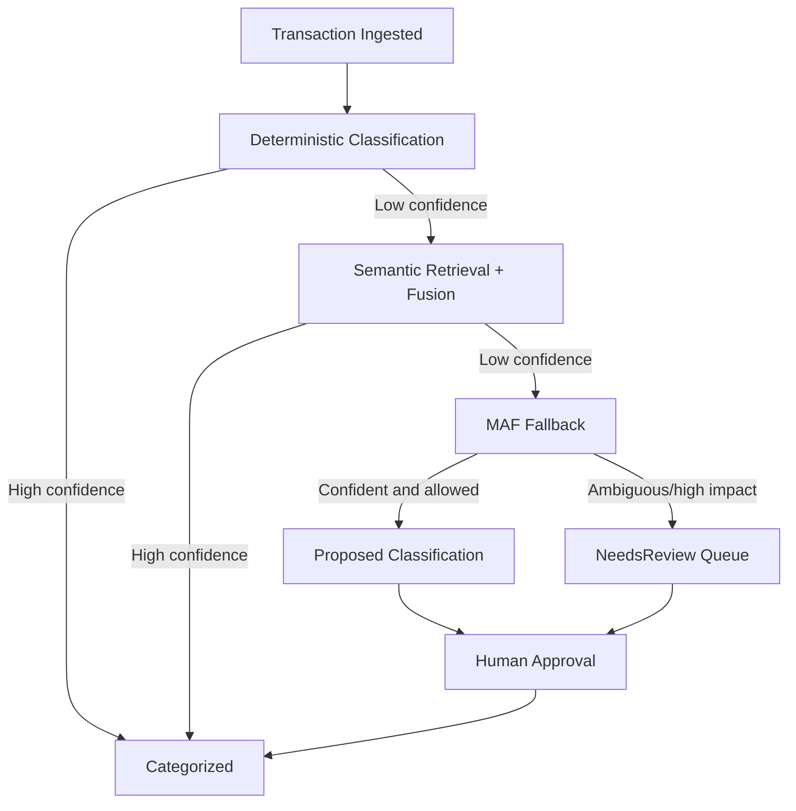

# AI Orchestration Flow

## Escalation Ladder
1. Deterministic classifier/rules execute first.
2. Semantic retrieval and confidence fusion execute next.
3. MAF fallback executes only when confidence is below policy threshold.
4. Ambiguous/high-impact outcomes route to `NeedsReview` with human approval required.

## Policy Requirements
- Never bypass `NeedsReview` when policy marks an action ambiguous or high impact.
- Never auto-send external communications; agent may draft only.
- Release evidence is governed by MM-AI-11 and MM-AI-12 tasks before production promotion.
