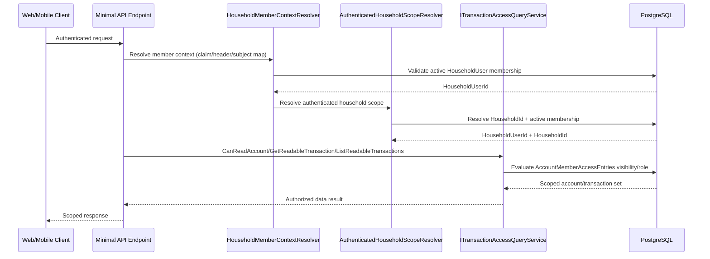
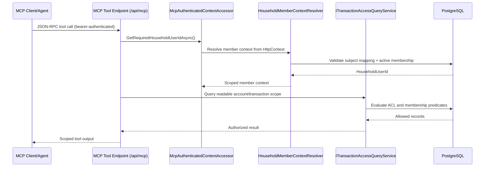

# Auth Scope and Access Control Flow

Last updated: 2026-03-01

## Purpose
Capture how authenticated identity is translated into household-member scope and then enforced through account-level access queries for both REST and MCP surfaces.

## Key Runtime Components
- `HouseholdMemberContextResolver`
- `AuthenticatedHouseholdScopeResolver`
- `McpAuthenticatedContextAccessor`
- `ITransactionAccessQueryService`
- `AccountMemberAccessEntries` + active `HouseholdUsers` membership checks

## Diagram A: REST Endpoint Scope Resolution

## Diagram B: MCP Tool Scope Resolution

## Guardrails
- Caller-supplied identity IDs are not trusted for authorization decisions.
- Ambiguous membership mapping fails closed.
- Reads and mutations must pass household-member and account ACL checks before business logic execution.
