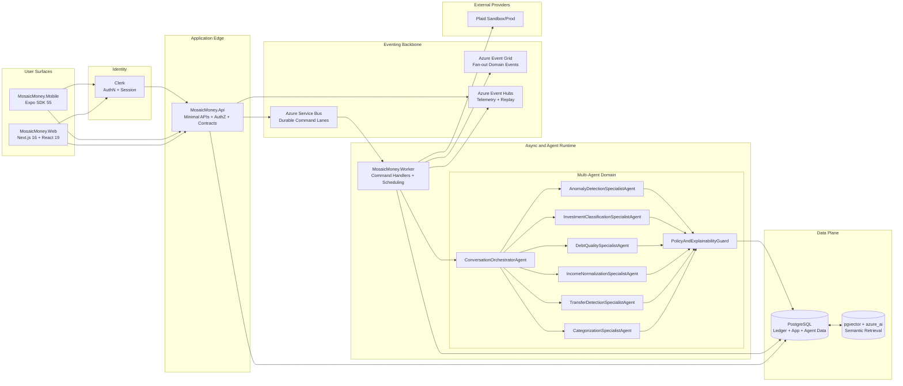
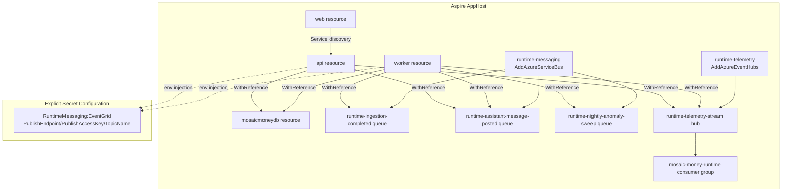
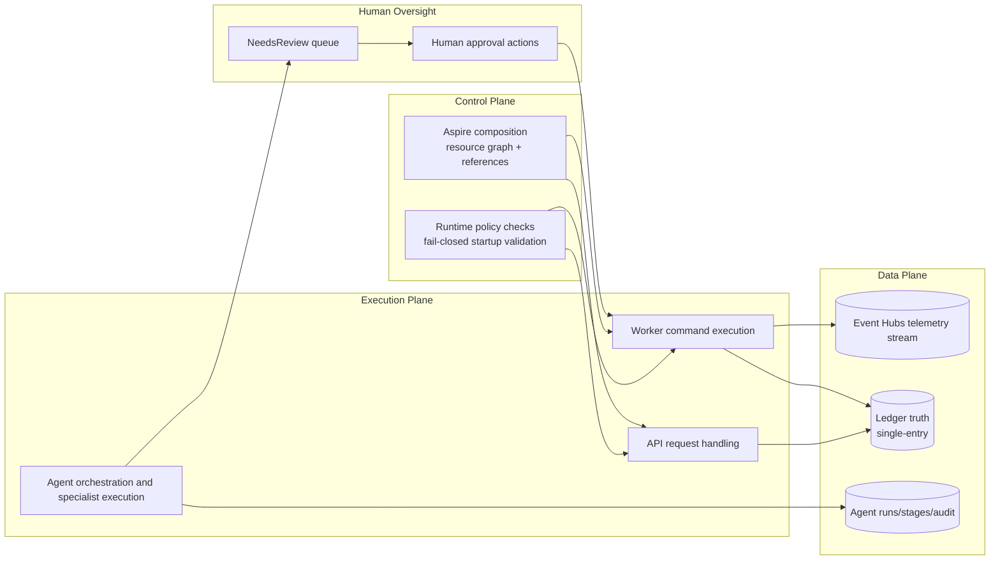
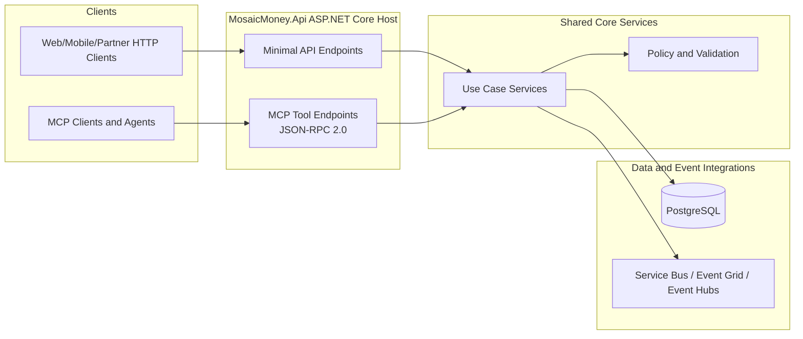

# Master Platform Architecture

Last updated: 2026-02-27

## Purpose
This document provides the platform-level architecture diagrams that span every major Mosaic Money surface and runtime boundary:

- Web and mobile frontends
- API and worker services
- Multi-agent runtime
- Eventing services
- PostgreSQL persistence
- External integrations and identity
- Observability and operations boundaries

## Diagram 1: End-to-End Platform Topology

## Diagram 2: Service and Resource Wiring (Aspire-Centric)

## Diagram 3: Control, Data, and Governance Boundaries

## Diagram 4: Unified Minimal API and MCP Entrypoints

See `docs/architecture/unified-api-mcp-entrypoints.md` for implementation constraints and composition rules.

## Coverage Notes
- This file is the master topology view and intentionally overlaps with deeper implementation docs.
- Use `multi-agent-system-topology.md` and `multi-agent-orchestration-sequences.md` for execution-level detail.
- Use `unified-api-mcp-entrypoints.md` for the REST+MCP shared-core architecture standard.
- Keep this document synchronized when adding or removing a service, queue, stream, agent, or major integration boundary.
