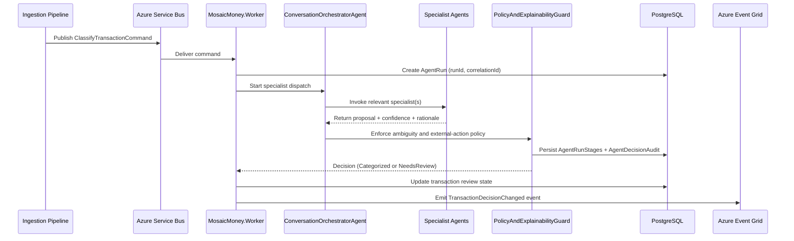
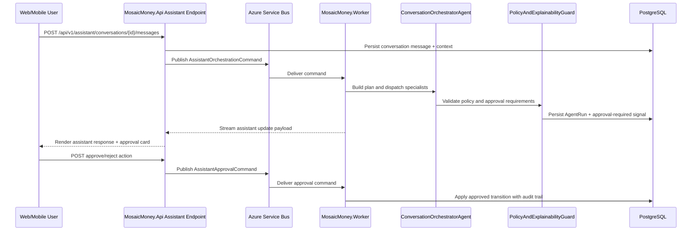

# Multi-Agent Orchestration Sequences

## Purpose
Capture the primary runtime trigger flows for event-driven and conversational multi-agent orchestration.

## Sequence A: Ingestion Completion to Classification Decision

## Sequence B: Conversational Assistant with Approval Card

## Trigger Matrix
| Trigger | Transport | Owner | Fail-Closed Behavior |
|---|---|---|---|
| Ingestion completed | Service Bus command | Worker | Route uncertain classification to `NeedsReview` |
| Assistant message posted | Service Bus command | Worker | Return advisory-only response when policy context is incomplete |
| Decision state changed | Event Grid event | Worker | Do not emit completion event if audit persistence fails |
| Trace and scoring events | Event Hubs stream | API/Worker | Do not block business command completion on telemetry stream backpressure |
| Nightly anomaly sweep | Scheduler -> Service Bus | Worker | Queue retry with dead-letter escalation when command exceeds retry policy |
