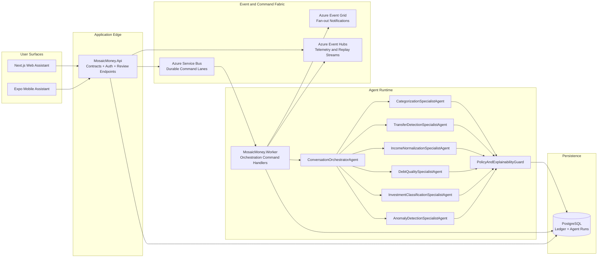

# Multi-Agent System Topology

## Purpose
Define the runtime component topology for Mosaic Money multi-agent orchestration, including worker ownership, eventing boundaries, and conversational assistant integration.

## Scope
- Product runtime architecture only.
- No coding-agent mode configuration.

## Topology Diagram

## Runtime Ownership Rules
- API owns request validation, auth, and explicit review-action contracts.
- Worker owns asynchronous orchestration and command retries.
- Agent decisions must persist run/stage provenance before user-visible completion.
- Guardrail checks execute before any state transition away from `NeedsReview`.

## Required Persistence for This Topology
- `AgentRuns`
- `AgentRunStages`
- `AgentSignals`
- `AgentDecisionAudit`
- `IdempotencyKeys`
