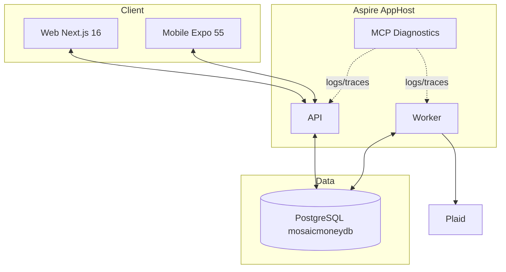

# System Topology

## Runtime Components
- `MosaicMoney.Web` (Next.js 16)
- `MosaicMoney.Mobile` (Expo SDK 55)
- `MosaicMoney.Api` (.NET 10 Minimal API)
- `MosaicMoney.Worker` (.NET 10 background ingestion)
- PostgreSQL (`mosaicmoneydb`) with extension path for `pgvector` and `azure_ai`
- Aspire AppHost orchestrating local and deployment topology

## Connectivity Contract
- API and Worker consume database connectivity by Aspire reference wiring.
- AppHost mode selects either external connection string or local/provisioned server.
- Frontend/mobile never receive secrets; only server-side services resolve secret material.
