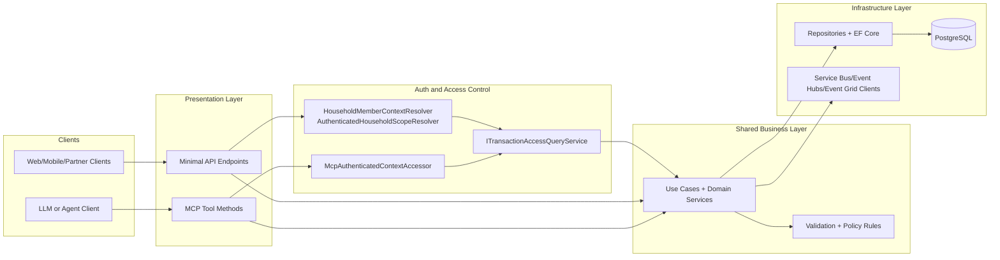
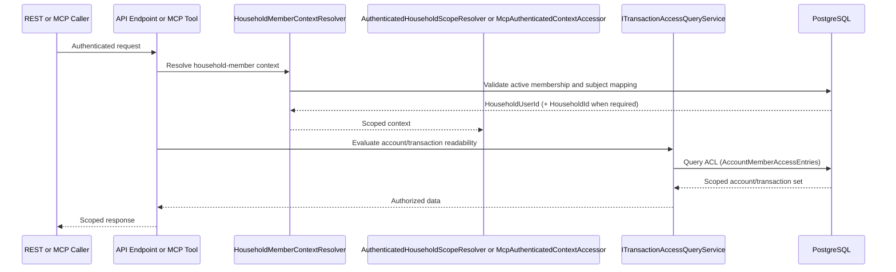

# Unified API and MCP Entrypoints

Last updated: 2026-03-01

Status note (2026-03-01):
- Foundry hosted agent bootstrap is intentionally running in minimal mode (model + prompt only) while API/MCP entrypoint hardening is completed.
- Native Postgres container MCP integration is paused in favor of first-party Mosaic MCP tools backed by shared API business services.
- Shared transaction access/query services now back both REST transaction endpoints and MCP transaction tools to keep one authorization and data-shaping path.
- REST and MCP flows now share authenticated household-member scope resolution before any account-scoped query or mutation.

## Purpose
Define the Mosaic Money pattern for hosting standard REST endpoints (Minimal APIs) and MCP tools in the same ASP.NET Core service while reusing one shared business logic layer.

## Why this pattern
- Minimal APIs and MCP tools use different transport protocols.
- Minimal APIs are HTTP request/response endpoints.
- MCP tools are JSON-RPC 2.0 operations over MCP transports.
- The MCP SDK does not auto-convert `app.MapGet(...)` routes to MCP tools.

Because of this, both presentation layers must wrap shared domain/application services rather than embedding business logic in route or tool methods.

## Layered Architecture


## Authenticated Scope Resolution Flow


## Project Organization Standard (MosaicMoney.Api)
Target structure for unified API + MCP delivery:

1. `src/MosaicMoney.Api/Core/`
2. `src/MosaicMoney.Api/Apis/`
3. `src/MosaicMoney.Api/Mcp/`
4. `src/MosaicMoney.Api/Program.cs`

Mapping to current repository conventions:

- `Core/`: use-case services and orchestration-safe business logic (can reference `Domain/` and `Data/` abstractions).
- `Apis/`: Minimal API route groups as thin wrappers.
- `Mcp/`: MCP tool entrypoints as thin wrappers using `[McpServerToolType]` and `[McpServerTool]`.
- `Program.cs`: composition root only (DI, endpoint registration, transport mapping).

## Composition Rules
1. Business logic must not live inside `app.Map*` handlers.
2. Business logic must not live inside MCP tool methods.
3. REST and MCP wrappers can shape output differently, but both must call the same core service methods.
4. MCP tool descriptions must be explicit and reviewable for agent safety.
5. Authorization and policy checks remain centralized in shared services and policy components.

## Runtime Wiring Pattern
Use this pattern when MCP endpoints are enabled in `MosaicMoney.Api`:

1. Register core services in DI.
2. Register MCP server (`ModelContextProtocol.AspNetCore`) and discover tools from assembly.
3. Map Minimal API endpoints.
4. Map MCP transport endpoints.

High-level pseudo-flow:

```csharp
builder.Services.AddScoped<ISharedUseCaseService, SharedUseCaseService>();

builder.Services.AddMcpServer()
    .WithHttpTransport(options =>
    {
        options.Stateless = false;
        options.IdleTimeout = TimeSpan.FromMinutes(30);
    })
    .AddAuthorizationFilters()
    .WithToolsFromAssembly();

var app = builder.Build();

app.MapGroup("/api").MapSharedEndpoints();
app.MapMcp("/api/mcp");
```

Current implementation note:

- `MosaicMoney.Api` exposes taxonomy and transaction MCP tools and routes reads/mutations through shared business services (`ITransactionAccessQueryService`, taxonomy business services) for consistent authorization.
- `MosaicMoney.Api` requires authenticated access on `/api/mcp`, enables MCP authorization filters, and marks tool surfaces with `[Authorize]`.
- MCP tools now derive household-member identity from authenticated HTTP context instead of accepting caller-supplied identity IDs.

## Transport and auth direction
- Baseline transport: `ModelContextProtocol.AspNetCore` `.WithHttpTransport()` on `MosaicMoney.Api` as the Streamable HTTP-compatible path.
- Endpoint contract: keep MCP mounted at `/api/mcp` over HTTPS and require bearer-authenticated access.
- Authentication requirement: MCP tool execution must always resolve user context and enforce per-household/per-user data authorization before any read/write operation.
- Rollout policy: validate each MCP client path for HTTP transport and authorization header propagation before removing any legacy compatibility path.
- Rollback policy: if a required client fails authenticated HTTP MCP calls, keep server transport unchanged and park that client migration until SDK compatibility is confirmed.

## Service Bus decision matrix
Use Service Bus where asynchronous decoupling adds reliability or scale. Do not route all API or MCP traffic through queues by default.

Use direct REST/MCP request-response when:
- The caller needs immediate results.
- Authorization depends on current authenticated user claims.
- The operation is short-lived and deterministic.

Use Service Bus when:
- The workflow is long-running or retry-heavy.
- Work must continue through downstream outages.
- Queue-based load leveling is needed for bursty traffic.

Mosaic Money application of this matrix:
- Keep interactive taxonomy, review, and ledger-facing tool calls on direct API/MCP paths.
- Keep async embeddings, ingestion fan-out, and deferred orchestration commands on message lanes.

## Guardrails and Constraints
- Do not expose secrets or raw connection details through MCP tools.
- Keep single-entry ledger semantics unchanged regardless of transport.
- Route ambiguous/high-impact outcomes to `NeedsReview` in both REST and MCP paths.
- Keep AppHost/Aspire references as the source for service connectivity.

## Delivery Notes
- This pattern is architecture guidance and implementation target for ongoing API evolution.
- Apply incrementally: each new feature slice should place logic in shared core services first, then add REST and MCP wrappers as needed.
- See `docs/architecture/auth-scope-and-access-control-flow.md` for deeper scope-resolution and ACL flow diagrams.
