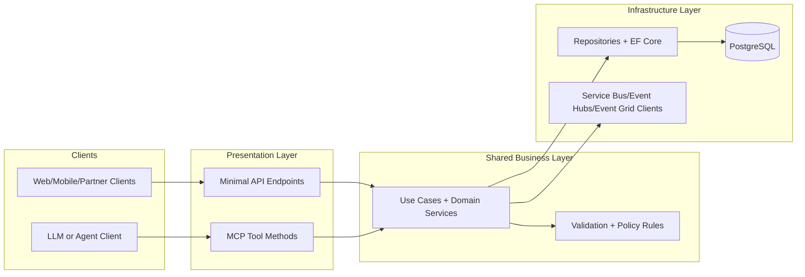

# Unified API and MCP Entrypoints

Last updated: 2026-02-27

## Purpose
Define the Mosaic Money pattern for hosting standard REST endpoints (Minimal APIs) and MCP tools in the same ASP.NET Core service while reusing one shared business logic layer.

## Why this pattern
- Minimal APIs and MCP tools use different transport protocols.
- Minimal APIs are HTTP request/response endpoints.
- MCP tools are JSON-RPC 2.0 operations over MCP transports.
- The MCP SDK does not auto-convert `app.MapGet(...)` routes to MCP tools.

Because of this, both presentation layers must wrap shared domain/application services rather than embedding business logic in route or tool methods.

## Layered Architecture


## Project Organization Standard (MosaicMoney.Api)
Target structure for unified API + MCP delivery:

1. `src/MosaicMoney.Api/Core/`
2. `src/MosaicMoney.Api/Apis/`
3. `src/MosaicMoney.Api/McpTools/`
4. `src/MosaicMoney.Api/Program.cs`

Mapping to current repository conventions:

- `Core/`: use-case services and orchestration-safe business logic (can reference `Domain/` and `Data/` abstractions).
- `Apis/`: Minimal API route groups as thin wrappers.
- `McpTools/`: MCP tool entrypoints as thin wrappers using `[McpServerToolType]` and `[McpServerTool]`.
- `Program.cs`: composition root only (DI, endpoint registration, transport mapping).

## Composition Rules
1. Business logic must not live inside `app.Map*` handlers.
2. Business logic must not live inside MCP tool methods.
3. REST and MCP wrappers can shape output differently, but both must call the same core service methods.
4. MCP tool descriptions must be explicit and reviewable for agent safety.
5. Authorization and policy checks remain centralized in shared services and policy components.

## Runtime Wiring Pattern
Use this pattern when MCP endpoints are enabled in `MosaicMoney.Api`:

1. Register core services in DI.
2. Register MCP server (`ModelContextProtocol.AspNetCore`) and discover tools from assembly.
3. Map Minimal API endpoints.
4. Map MCP transport endpoints.

High-level pseudo-flow:

```csharp
builder.Services.AddScoped<ISharedUseCaseService, SharedUseCaseService>();

builder.Services.AddMcpServer()
    .WithHttpServerTransport()
    .WithToolsFromAssembly();

var app = builder.Build();

app.MapGroup("/api").MapSharedEndpoints();
app.MapMcp();
```

## Guardrails and Constraints
- Do not expose secrets or raw connection details through MCP tools.
- Keep single-entry ledger semantics unchanged regardless of transport.
- Route ambiguous/high-impact outcomes to `NeedsReview` in both REST and MCP paths.
- Keep AppHost/Aspire references as the source for service connectivity.

## Delivery Notes
- This pattern is architecture guidance and implementation target for ongoing API evolution.
- Apply incrementally: each new feature slice should place logic in shared core services first, then add REST and MCP wrappers as needed.
