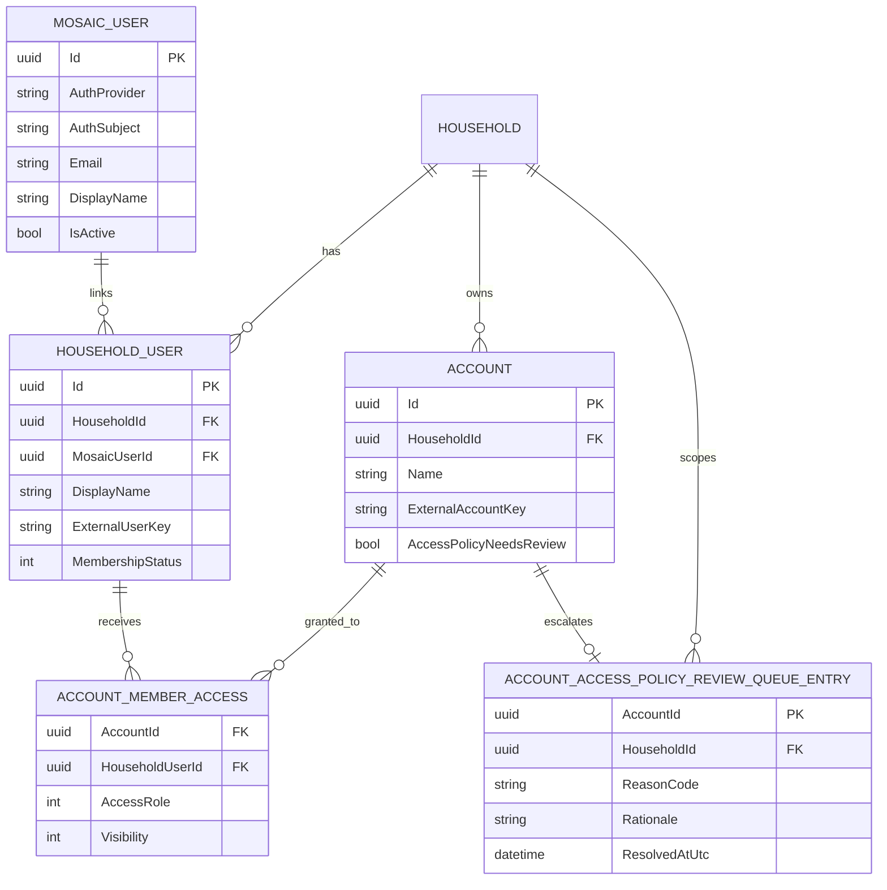

# Identity And Access Model

## Purpose
Define household identity, membership, and account-level access controls required by M7 scope enforcement.

## Core Entities
- `Household`: top-level scope for users and accounts.
- `MosaicUser`: canonical authenticated person (`AuthProvider` + `AuthSubject`).
- `HouseholdUser`: household membership record and lifecycle status.
- `Account`: financial account associated with a household.
- `AccountMemberAccess`: explicit per-account access role and visibility grant.
- `AccountAccessPolicyReviewQueueEntry`: fail-closed queue record when account access policy requires review.

## Rules
- Identity mapping is explicit and auditable via unique `MosaicUser(AuthProvider, AuthSubject)`.
- Membership is status-aware (`Active`, `Invited`, `Removed`) and one active membership per `(HouseholdId, MosaicUserId)` is enforced.
- Account permissions are explicit per `(AccountId, HouseholdUserId)` with role/visibility consistency checks.
- Ambiguous access decisions route to `AccountAccessPolicyReviewQueueEntry` and keep `Account.AccessPolicyNeedsReview` fail-closed until resolved.

