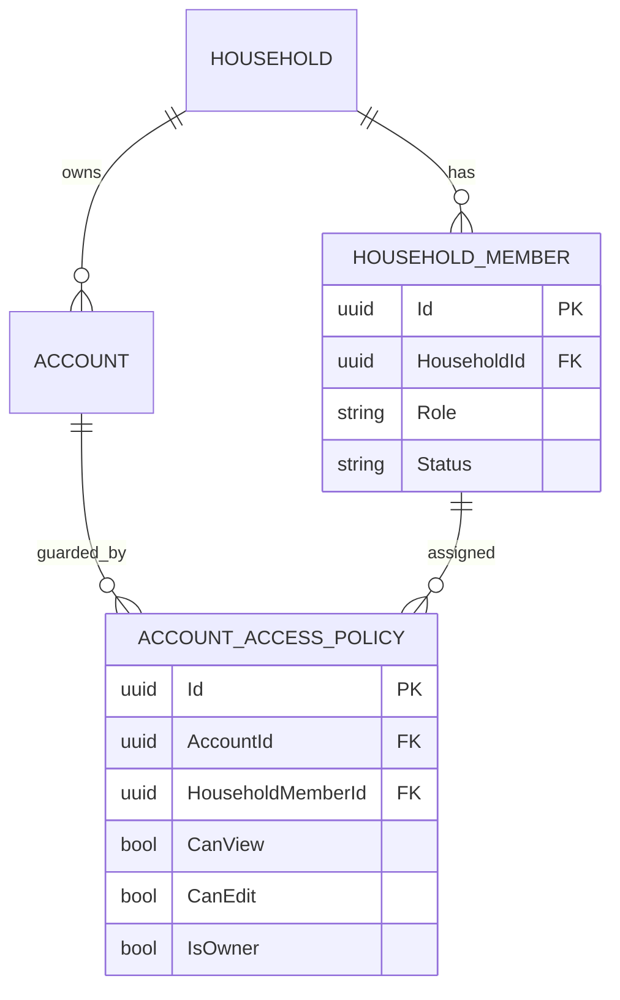

# Identity And Access Model

## Purpose
Define household ownership and account-level permissions required by M7 identity scope.

## Core Entities
- `Household`: top-level scope for users and accounts.
- `HouseholdMember`: membership record with role and state.
- `Account`: financial account associated with a household.
- `AccountAccessPolicy`: explicit per-account ownership and access flags.
- `NeedsReviewAssignment`: review ownership linkage for ambiguous actions.

## Rules
- Ownership and permissions are explicit and auditable.
- High-impact actions require reviewable policy checks.
- Access backfills and contract tests must remain green before release gating.

