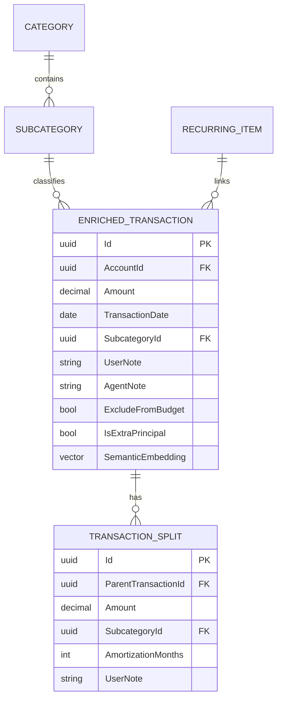

# Ledger Core Model

## Core Entities
- `EnrichedTransaction`: canonical single-entry transaction row.
- `TransactionSplit`: optional child allocations for a parent transaction.
- `RecurringItem`: expected recurring charge template and cadence metadata.
- `SinkingFund`: planned reserve tracking (projection/plan layer).
- `Category` / `Subcategory`: classification hierarchy.

## Constraints
- No double-entry debit/credit model is introduced.
- `UserNote` and `AgentNote` remain separate persisted fields.
- Amortization and projection computations do not mutate raw transaction truth.

