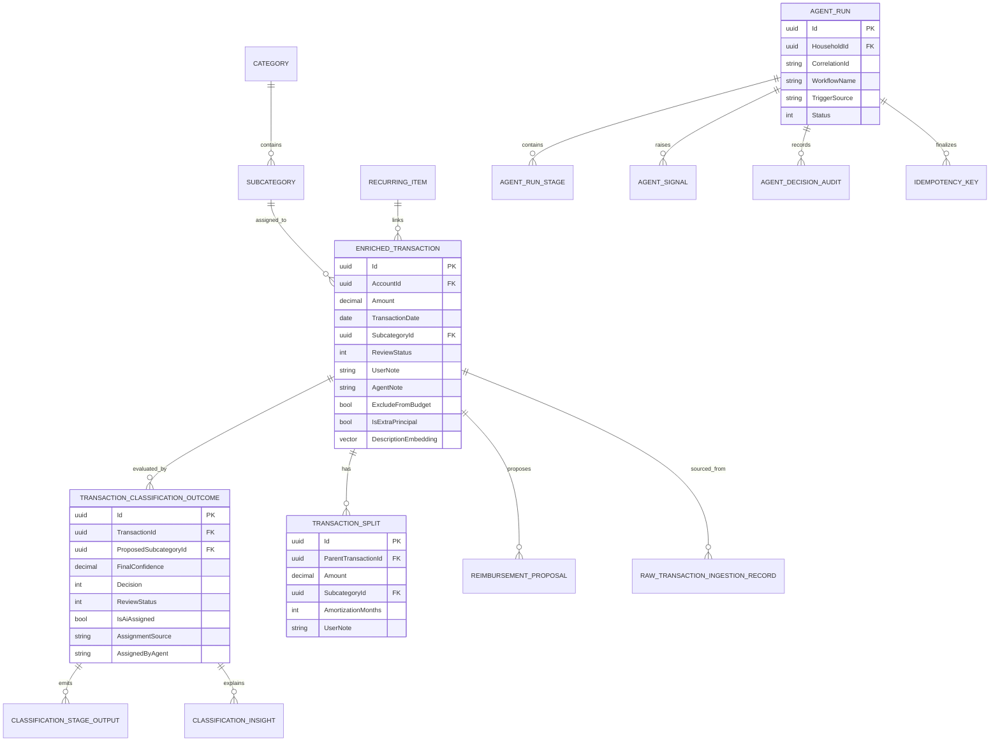

# Ledger Core Model

## Core Entities
- `EnrichedTransaction`: canonical single-entry transaction row.
- `TransactionSplit`: optional child allocations for a parent transaction.
- `RecurringItem`: expected recurring charge template and cadence metadata.
- `Category` / `Subcategory`: classification hierarchy.
- `TransactionClassificationOutcome`: final decision + confidence + assignment provenance for classification.
- `ClassificationStageOutput` and `ClassificationInsight`: per-stage trace and explainability records.
- `ReimbursementProposal`: reviewable reimbursement linkage workflow.
- `RawTransactionIngestionRecord`: immutable source payload lineage and processing cursor.
- `AgentRun` / `AgentRunStage` / `AgentSignal` / `AgentDecisionAudit` / `IdempotencyKey`: runtime conversational and workflow provenance.

## Constraints
- No double-entry debit/credit model is introduced.
- `UserNote` and `AgentNote` remain separate persisted fields.
- Amortization and projection computations do not mutate raw transaction truth.
- Ambiguous or high-impact classification remains fail-closed via `ReviewStatus = NeedsReview` and explicit audit records.

