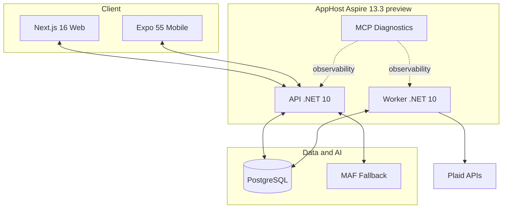

# Mosaic Money Architecture

## 1. Scope
This file is the canonical architecture index and decision summary. Detailed diagrams and model artifacts are now split into dedicated docs:

- `docs/architecture/README.md`
- `docs/architecture/system-topology.md`
- `docs/architecture/ai-orchestration-flow.md`
- `docs/architecture/deployment-modes.md`
- `docs/data-models/README.md`
- `docs/data-models/ledger-core-model.md`
- `docs/data-models/identity-access-model.md`

## 2. Current Stack (2026-02)
- Backend: C# 14 / .NET 10 Minimal APIs.
- Orchestration: Aspire 13.3 preview (daily channel) with AppHost composition and MCP diagnostics.
- Web: Next.js 16 + React 19 + Tailwind.
- Mobile: Expo SDK 55 + React Native.
- Data: PostgreSQL with `pgvector` and `azure_ai` extension path.
- AI: Deterministic + semantic retrieval + MAF fallback with release-gate governance.

## 3. Core Architecture Rules
- Single-entry ledger semantics are immutable source truth.
- `UserNote` and `AgentNote` remain separate storage and UI lanes.
- Escalation order is fixed: deterministic -> semantic -> MAF.
- Ambiguous/high-impact outcomes route to `NeedsReview`.
- External messaging actions are deny-by-default.
- Aspire `WithReference(...)` and service discovery are required over hardcoded endpoints.

## 4. Runtime Topology (Current)

## 5. Database Connectivity Modes
AppHost supports two explicit modes:

1. External connection-string mode:
`ConnectionStrings:mosaicmoneydb` is supplied and AppHost consumes it directly.
2. Provisioned local mode:
AppHost provisions `mosaic-postgres` with `AddAzurePostgresFlexibleServer(...).RunAsContainer()` and references `mosaicmoneydb`.

See `docs/architecture/deployment-modes.md` for operational details and troubleshooting paths.

## 6. AI Governance Notes
- Release blocking is defined by MM-AI-11.
- Official evaluator replay and artifact mapping is MM-AI-12 (`In Review` until cloud evidence is captured).
- Architecture details for evaluation/replay are documented in `docs/architecture/ai-orchestration-flow.md`.

## 7. Decision Log Snapshot
- Canonical PostgreSQL resource: `mosaic-postgres`.
- Canonical DB/connection name: `mosaicmoneydb`.
- DB-only Azure provisioning uses `src/apphost.database/apphost.cs`.
- Aspire deploy remains AppHost-scoped; DB-only rollout is achieved by deploying the DB-only AppHost project.