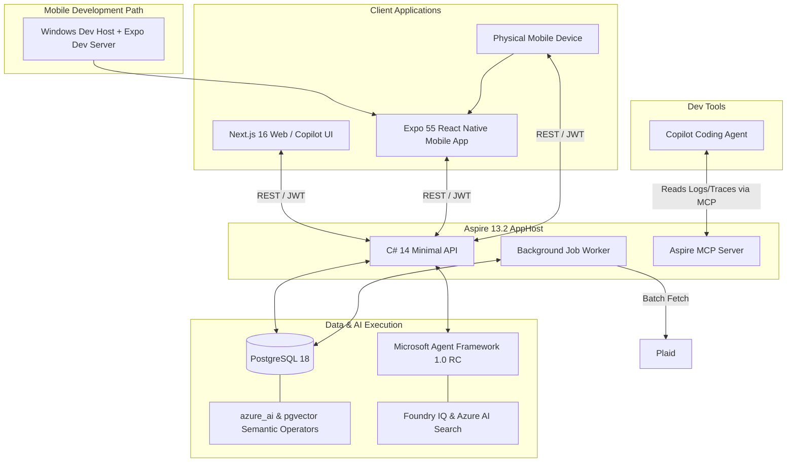
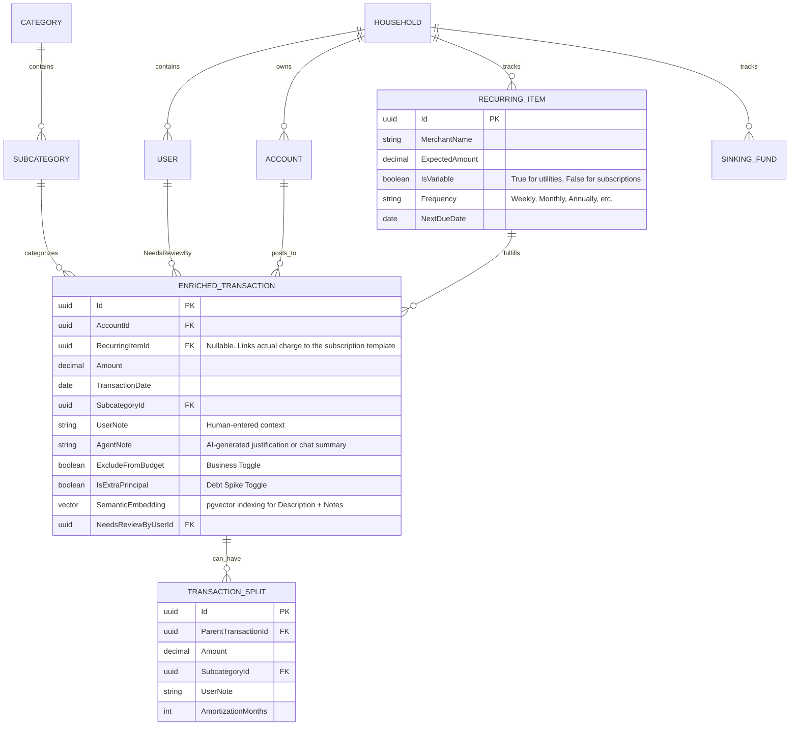
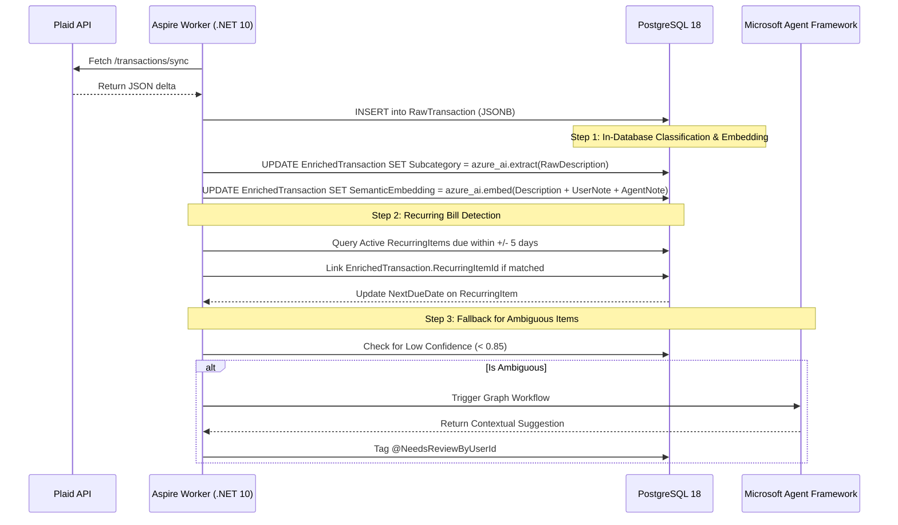
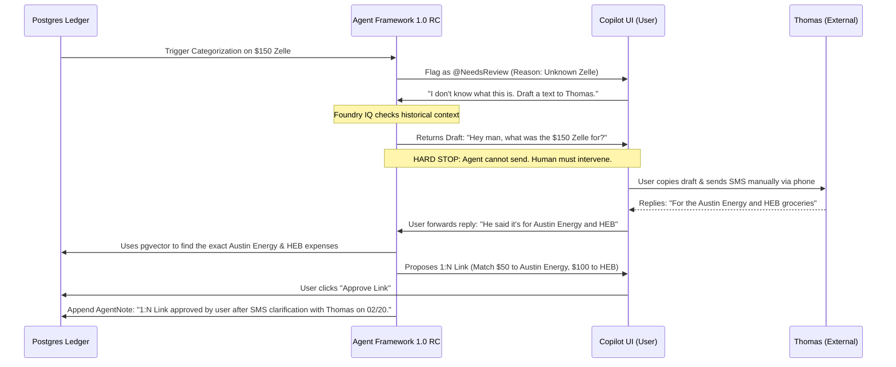
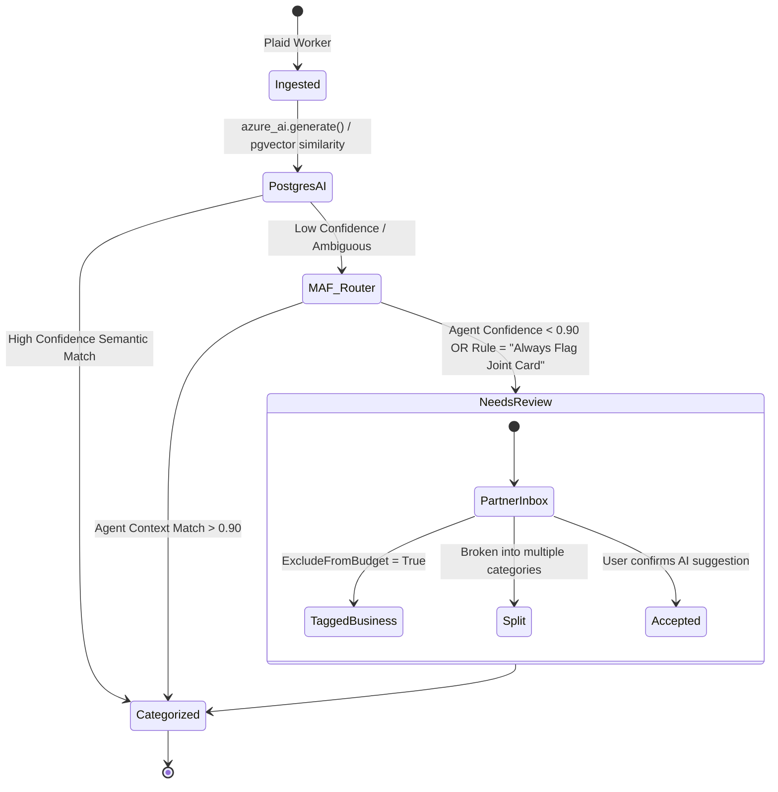

# System Architecture & Agent Guidelines

## 1. Agent Guardrails & 2026 Tech Stack
When generating code for this repository, the AI agent MUST adhere to the following architectural constraints based on the early 2026 technology landscape:
* **Backend:** C# 14 / .NET 10 LTS (v10.0.3+). Use Minimal APIs. 
* **Orchestration:** .NET Aspire 13.2 (Daily Build). The platform is natively polyglot, orchestrating the C# API, Background Workers, and the Next.js frontend via `AddJavaScriptApp`.
* **Database orchestration mode:** AppHost uses Aspire Azure PostgreSQL hosting integration (`AddAzurePostgresFlexibleServer`). Local full-stack runs use `.RunAsContainer()` and Azure deployments use Flexible Server provisioning.
* **Agentic Observability:** Aspire 13.2 automatically provisions a **Model Context Protocol (MCP) Server**. This allows the Copilot coding agent to directly query live resources, stream logs, and inspect traces during development without requiring human copy-pasting.
* **Web Frontend:** Next.js 16 LTS (App Router) using React 19 and Tailwind CSS.
* **Mobile Frontend:** React Native via Expo SDK 55 for mobile apps. MVP release focus is iPhone. Primary developer flow is Windows dev host + Expo dev server + physical phone testing. Shares 60-70% of business logic with the web app.
* **Database:** PostgreSQL 18.2+ using Entity Framework Core 10. **Must leverage `azure_ai` extension and `pgvector` with HNSW indexing by default.**
* **Vector indexing policy:** Standardize current implementation on HNSW immediately; evaluate DiskANN in a dedicated spike behind an environment gate before any production default switch.
* **AI Framework:** Microsoft Agent Framework (MAF) 1.0 RC + `Microsoft.Extensions.AI`. *Note: Copilot is the UI, not the orchestration engine.*

---

## 2. Polyglot System Context & AI Topology

This diagram illustrates the macro-level boundaries. Notice how Aspire 13.2 orchestrates both the UI and API, while the MCP server provides live debug context directly to the coding agent.



### Mobile development and deployment path
- Develop mobile UI and features on Windows using Expo dev server (`start`, `start:lan`, `start:tunnel`).
- Validate day-to-day mobile behavior on physical phone devices (Expo Go or development builds).
- Produce installable phone artifacts via cloud iOS build/signing pipeline when release-ready.
- Keep API interactions server-backed and secret-free on client surfaces (`EXPO_PUBLIC_*` values are public).
- Use Mac-backed iOS simulator workflows only when explicitly needed for simulator-specific debugging.

---

## 3. Core Data Model (Entity Relationship Diagram)

This schema maps the relationships required to support single-entry accounting, multi-month amortization, the dual-track note system, and the recurring subscription engine.



---

## 4. C# Entity Framework Core Context (Grounding Snippet)
*Agent Instruction: Utilize C# 14 features like the `field` keyword for simplified property validation. Strictly adhere to this single-entry ledger model.*

```csharp
public class EnrichedTransaction 
{
    public Guid Id { get; set; }
    public string PlaidTransactionId { get; set; } = string.Empty; // Idempotency key
    public decimal Amount { get; set; }
    
    // C# 14 Field-Backed Property for validation
    public DateTime Date 
    { 
        get; 
        set => field = value > DateTime.UtcNow ? throw new ArgumentException("Future dates invalid") : value; 
    }
    
    // Attribution & Hierarchy
    public Guid? SubcategoryId { get; set; }
    public Guid? RecurringItemId { get; set; }
    public Guid? NeedsReviewByUserId { get; set; } 
    
    // Dual-Track Notes
    public string? UserNote { get; set; }
    public string? AgentNote { get; set; }
    
    // Isolation Toggles
    public bool ExcludeFromBudget { get; set; } 
    public bool IsExtraPrincipal { get; set; }
    
    // Concurrency & Audit
    public DateTime LastModifiedAt { get; set; }
    public string ModifiedBy { get; set; } = "System"; 
}
```

---

## 5. Semantic Ingestion & Recurring Matcher Flow

This flow demonstrates how the Aspire worker detects if an incoming transaction fulfills an expected subscription, marking it "paid" for the month, while simultaneously using PostgreSQL's semantic operators to vectorize notes.



---

## 6. Agentic Human-in-the-Loop (HITL) Communication Flow
**Context Constraint:** The MAF agent must NEVER execute external messaging APIs autonomously. It acts purely as a drafter and memory-keeper.



---

## 7. Needs Review State Machine
This dictates how the API handles ambiguous transactions (e.g., joint card purchases that might be for the KDP business). 



---

## 8. Architectural Trade-offs & Implementation Directives
* **Next.js vs. Blazor:** We are using Next.js because React Native (Expo) allows us to share 60-70% of business logic and UI components with the mobile app. Blazor lacks this robust mobile code-sharing ecosystem.
* **Single-Entry vs. Double-Entry:** The agent MUST NOT implement a double-entry accounting system. Plaid transactions are single-entry. Implementing double-entry for a personal finance app triples database complexity with zero added value for our core features (attribution, budgeting, and recurring tracking).
* **In-Database AI vs. API LLM Calls:** The agent MUST prioritize PostgreSQL's `azure_ai` extension for standard categorization and vector search. LLM API calls via the Agent Framework are slow and expensive; they should be strictly reserved as a fallback for the `@NeedsReview` queue or complex conversational reasoning.

---

## 9. Azure PostgreSQL Deployment Decision (2026-02-23)

### Decision
- Use `AddAzurePostgresFlexibleServer("mosaic-postgres")` as the canonical AppHost database resource type.
- Keep local developer velocity by using `.RunAsContainer()` in `src/apphost.cs` for full-stack local runs.
- Use a dedicated DB-only AppHost (`src/apphost.database/apphost.cs`) when provisioning only the database service in Azure.
- Use Mosaic-prefixed parameter keys for server credentials: `mosaic-postgres-admin-username`, `mosaic-postgres-admin-password`.

### Why
- Local container images do not provide `azure_ai`, while Azure Database for PostgreSQL Flexible Server supports `azure_ai` and `vector` when configured.
- Database-only rollout reduces deployment blast radius while stabilizing extension and schema behavior before deploying the rest of the stack.

### Deploy-Only-Database Aspire CLI Flow
1. Configure AppHost secrets for admin credentials in file-based user-secrets:
    `dotnet user-secrets set "Parameters:mosaic-postgres-admin-username" "<admin-user>" --file src/apphost.database/apphost.cs`
    `dotnet user-secrets set "Parameters:mosaic-postgres-admin-password" "<admin-password>" --file src/apphost.database/apphost.cs`
2. Deploy Key Vault first (recommended for this AppHost shape):
    `aspire do provision-mosaic-postgres-kv --project src/apphost.database/apphost.cs --environment Production`
3. Apply workload tags to the Key Vault:
    `az resource tag --ids <key-vault-resource-id> --tags mosaic=true workload=mosaic-money component=keyvault`
4. Deploy DB-only AppHost:
    `aspire deploy --project src/apphost.database/apphost.cs --environment Production`
5. Allow required extensions at server level:
    `az postgres flexible-server parameter set --resource-group <rg> --server-name <server> --name azure.extensions --value "vector,azure_ai"`
6. Tag the deployed server:
    `az resource tag --ids <postgres-resource-id> --tags mosaic=true workload=mosaic-money`
7. Enable extensions in target database:
    `CREATE EXTENSION IF NOT EXISTS vector;`
    `CREATE EXTENSION IF NOT EXISTS azure_ai;`
8. Verify:
    `SHOW azure.extensions;`
    `SELECT extname FROM pg_extension WHERE extname IN ('vector','azure_ai');`

### Deployment Recommendation Update
- For DB-only provisioning with the current Aspire graph, provision Key Vault first, then continue with database provisioning.
- If `provision-*-kv-roles` fails due missing principal context, continue using the staged approach and complete PostgreSQL provisioning in an environment that supplies principal values for role assignment steps.

### Naming Convention
- Server resource (Aspire + Azure): `mosaic-postgres`.
- Database name/connection name: `mosaicmoneydb`.
- Convention pattern: `<workload>-postgres` for server resources and `<workload>db` for primary database.

### Instance Configuration Baseline
- Current Aspire-generated baseline (validated from publish artifacts): PostgreSQL version `16`, password authentication enabled, `Standard_B1ms` Burstable SKU, `32 GB` storage, HA disabled.
- Production recommendation for Mosaic Money AI workloads: move to General Purpose compute and explicitly tune SKU/storage/HA through `ConfigureInfrastructure(...)` before non-dev rollout.

### Scope Notes
- Aspire CLI currently does not expose a first-class `--resource` filter for `aspire deploy`; database-only deployment is achieved by deploying the DB-only AppHost file.