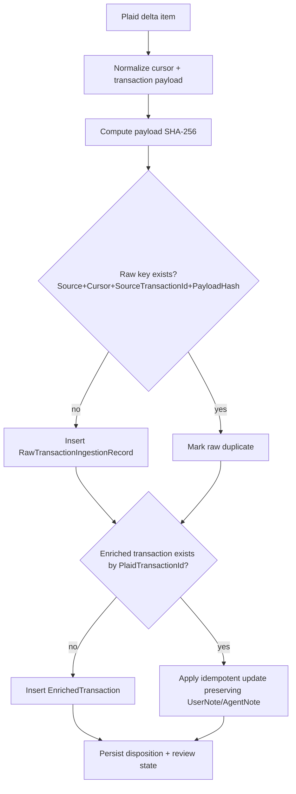
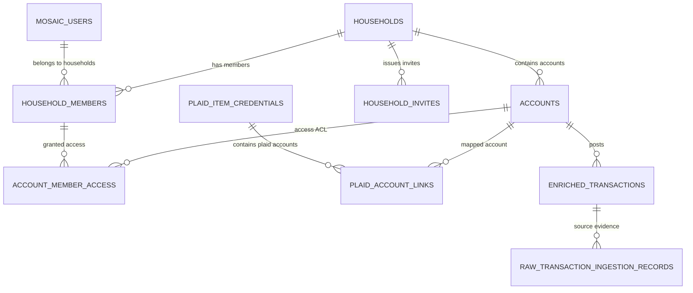
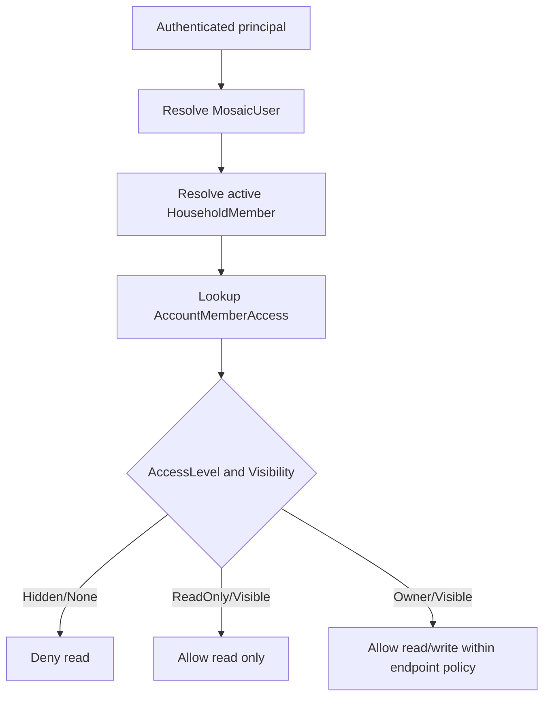

# Spec 008: M7 Identity, Household Access, and Account Ownership

## Status
- Drafted: 2026-02-25
- Milestone: M7
- Scope: Add first-class Mosaic user identity, household membership lifecycle, per-account access control, and Plaid account-link durability.

## Problem Statement
The current model supports `Household`, `HouseholdUser`, and `Account`, but it does not model top-level app identity and explicit per-member account visibility/ownership.

Missing capability examples from product workflows:
- A user has personal accounts only they can see.
- A partner has personal accounts only they can see.
- Both users share one or more joint accounts.
- A member has read-only visibility on specific accounts.
- Visibility can change without rewriting ledger truth.

## Current-State Findings
Current data model anchors:
- `Household`, `HouseholdUser`, and `Account` exist in `src/MosaicMoney.Api/Domain/Ledger/LedgerEntities.cs`.
- Transaction reads are account-id filtered, not member-ACL filtered (`src/MosaicMoney.Api/Apis/TransactionsEndpoints.cs`).

Current Plaid ingestion duplicate prevention (already present):
- Raw ingestion dedupe key uses `(Source, DeltaCursor, SourceTransactionId, PayloadHash)` unique index in `src/MosaicMoney.Api/Data/MosaicMoneyDbContext.cs`.
- Enriched dedupe uses unique `PlaidTransactionId` in `src/MosaicMoney.Api/Data/MosaicMoneyDbContext.cs`.
- `PlaidDeltaIngestionService` computes payload hash and treats same raw key as duplicate while preserving idempotent upsert semantics in `src/MosaicMoney.Api/Domain/Ledger/Ingestion/PlaidDeltaIngestionService.cs`.
- Regression tests prove idempotency and note preservation in `src/MosaicMoney.Api.Tests/PlaidDeltaIngestionServiceTests.cs`.

### Current duplicate-prevention pipeline (Mermaid)

## Design Goals
- Keep single-entry ledger semantics unchanged.
- Add first-class app identity table for login principals.
- Preserve household grouping while introducing member lifecycle and invitation flow.
- Add explicit account-level ACL to support mine-only, spouse-only, joint, and read-only visibility.
- Preserve ingestion idempotency and avoid duplicate Plaid account materialization.
- Default fail-closed when migration confidence is low.

## Target Relational Model

### Primary entities
- `MosaicUsers` (new): one row per authenticated app principal.
- `Households` (existing): finance grouping boundary.
- `HouseholdMembers` (evolve `HouseholdUsers`): membership and lifecycle states.
- `Accounts` (existing, extended): financial account records.
- `AccountMemberAccess` (new): explicit account visibility and permission per household member.
- `HouseholdInvites` (new): invite lifecycle and acceptance.
- `PlaidAccountLinks` (new): durable mapping of Plaid Item+Account to local Account.

### Mermaid ERD

## Access Semantics
- Mine-only account:
  - member A: `Owner + Visible`
  - member B: `None + Hidden`
- Spouse-only account:
  - member B: `Owner + Visible`
  - member A: `None + Hidden`
- Joint account:
  - member A: `Owner + Visible`
  - member B: `Owner + Visible`
- Shared read-only:
  - owner: `Owner + Visible`
  - member: `ReadOnly + Visible`

### Access decision flow (Mermaid)

## Constraints and Indexes
- `MosaicUsers`: unique `(AuthProvider, AuthSubject)`.
- `HouseholdMembers`: unique active `(HouseholdId, MosaicUserId)`.
- `AccountMemberAccess`: PK `(AccountId, HouseholdMemberId)`.
- `PlaidAccountLinks`: unique active `(PlaidEnvironment, ItemId, PlaidAccountId)`.
- Keep existing dedupe indexes unchanged:
  - `RawTransactionIngestionRecords` unique `(Source, DeltaCursor, SourceTransactionId, PayloadHash)`.
  - `EnrichedTransactions` unique `PlaidTransactionId`.

## API and Authorization Boundaries
- Resolve principal -> `MosaicUsers` -> active `HouseholdMembers`.
- All account and transaction reads must join through `AccountMemberAccess`.
- Add scoped filters: `mine`, `joint`, `shared`, `household`.
- Plaid write flows should stop trusting client-supplied household identity for authorization.

## Edge Cases and Required Handling
- Ownership transfer: enforce at least one owner per active account.
- Invite pending/expired/revoked states.
- Duplicate Plaid account link attempts route to `NeedsReview`.
- Unlink/relink keeps local account identity stable.
- Soft delete/reactivation restores ACL safely.
- Accidental over-sharing prevention via deny-by-default reads + explicit ACL grants.
- Multi-member backfill ambiguity sets `AccessPolicyNeedsReview=true` and queues human review.

## Migration Strategy (Incremental)
1. Add new tables/columns with no destructive drops.
2. Backfill `MosaicUsers` and membership rows.
3. Backfill account ACL with conservative defaults.
4. Introduce read-path ACL enforcement with legacy fallback during transition.
5. Cut over write-path authorization to ACL only.
6. Reconcile and remove legacy compatibility paths.

## Delivery Tasks
| ID | Task | Status |
|---|---|---|
| MM-BE-19 | Add Mosaic user identity model | In Review |
| MM-BE-20 | Evolve household membership model | In Review |
| MM-BE-21 | Add account ACL model | In Review |
| MM-BE-22 | Add Plaid account-link mapping table | In Review |
| MM-BE-23 | Enforce membership-aware API authorization | In Review |
| MM-BE-24 | Identity and ACL migration/backfill | In Review |
| MM-ASP-08 | Identity claim mapping configuration | Not Started |
| MM-ASP-09 | Migration rollout and rollback playbook | Not Started |
| MM-FE-19 | Household member and invite management UI | In Review |
| MM-FE-20 | Account sharing controls UI | Not Started |
| MM-FE-21 | Account visibility filters and badges | Not Started |
| MM-MOB-10 | Membership and invite parity | Not Started |
| MM-MOB-11 | Account sharing controls parity | Not Started |
| MM-MOB-12 | ACL-aware account and transaction views | Not Started |

## Acceptance Criteria
- Model supports mine-only, spouse-only, and joint account visibility simultaneously.
- No unauthorized account/transaction read is possible via direct account ID access.
- Plaid ingestion remains idempotent with existing duplicate-prevention guarantees.
- Migration has explicit fail-closed handling for ambiguous ownership/visibility records.
